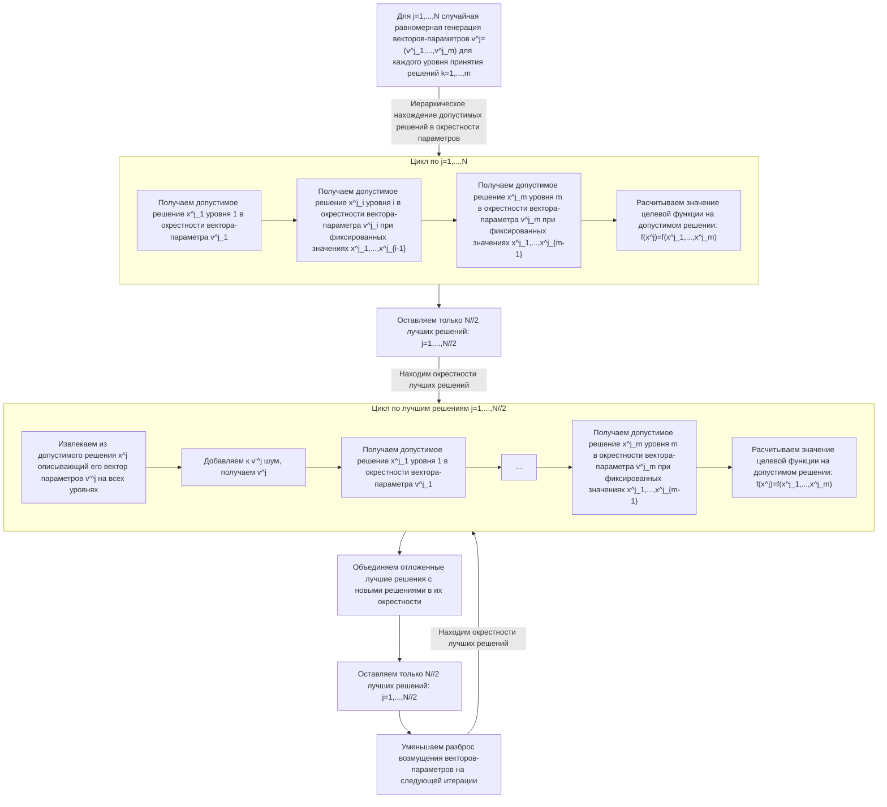

# Глобальный иерархический оптимизационный алгоритм

Дана задача оптимизации: $$\begin{aligned}&\text{minimize} \ f(x,y) \\ &\text{subject to} \\  &\quad x \in G_1 \\ & \quad (x,y) \in G_2, \end{aligned}\tag{P}$$которую можно рассматривать как задачу **иерархического принятия решения**: переменные решения $x$ – переменные верхнего уровня, "стратегические" (например, транспортные заказы, которые мы решаем принять в работу), а переменные $y$ – "операционные" переменные решения нижнего уровня, сильно зависящие от выбора $x$ (например, маршруты по выбранным заказам).

Функция $f$ – чёрный ящик, заданная, например, ансамблем прогнозных моделей (random forrest, gradient boosting, neural networks со сложной архитектурой), в общем случае 
- не непрерывная (в частности, не выпуклая, не дифференцируемая)
- дорого вычисляемая
- со сложной, плохо аппроксимируемой структурой

При этом, получить оптимальные решения для задач $$\begin{aligned}&\text{minimize} \ f_1(x) \\ &\text{subject to} \\  &\quad x \in G_1 \end{aligned}$$для любой простой (например, линейной) функции $f_1$ и $$\begin{aligned}&\text{minimize} \ f^x_2(y) \\ &\text{subject to} \\ & \quad (x,y) \in G_2 \end{aligned}$$для любого фиксированного $x \in G_1$ и простой функции $f_2^x$ – просто.

Дополнительно предполагаем, что $G_1$ и $G_2(x) \coloneqq \{y \mid (x,y) \in G_2\}$, $x \in G_1$ содержатся в компактных (многомерных) прямоугольниках $K_1$ и $K_2(x)$ соответственно.

## Эвристический алгоритм поиска оптимального решения (P)

Параметры алгоритма:
- $N \approx 100$ (число исследуемых точек в пространстве).
- $\sigma_i > 0$ (по каждой i-ой компоненте переменных решения) – длина её допустимого интервала.
- $\alpha \in \left(0, 1\right]$ – сжимающий коэффициент поиска.

1. Текущие номер итерации $k \coloneqq 0$.
2. Первоначальное исследование допустимого пространства. Выбираем случайно $N$ значений $a_1,\dots,a_N \in K_1$, где компоненты каждого вектора $a_j$ выбираются из **равномерного** распределения в допустимом интервале соответствующей грани прямоугольника $K_1$. Т.е выборка осуществляется равномерно из прямоугольника $K_1$.
3. Проецируем недопустимые $a_j \notin G_1$ на $G_1$ по l1-норме, т.е. решаем для каждого такого j оптимизационную задачу: $$\begin{aligned}&\text{minimize} \ \|x-a_j\|_1 \\ &\text{subject to} \\  &\quad x \in G_1 \end{aligned}$$Мы, таким образом, получим **допустимые** точки $x_1,\dots,x_N \in G_1$, каждая из которых находится максимально близко к случайно выбранным точкам $a_1,\dots,a_N$.
4. Выбираем случайно $N$ значений $b_1,\dots,b_N \in K_2$, где компоненты каждого вектора $b_j$ выбираются из **равномерного** распределения в допустимом интервале соответствующей грани прямоугольника $K_2(x_j)$. Практически это означает, что для каждого j мы
    - Анализируем множество $G_2(x_j)$ и стараемся получить минимальный компакт $K_2(x_j)$, в котором оно содержится. В худшем случае, это будет прямоугольник из компонент $K_2$, соответствующих переменным $y$.
    - Делаем выборку из полученного $K_2(x_j)$.
5. Проецируем недопустимые $b_j \notin G_2(x_j)$ на $G_2(x_j)$ по l1-норме, т.е. решаем для каждого такого j оптимизационную задачу: $$\begin{aligned}&\text{minimize} \ \|y - b_j\|_1 \\ &\text{subject to} \\  &\quad y \in G_2(x_j) \end{aligned}$$Мы, таким образом, получим **допустимые** точки $x_1,\dots,x_N \in G_1$; $(x_1, y_1),\dots, (x_N, y_N) \in G_2$, каждая из которых находится максимально близко к случайно выбранным точкам $a_1,\dots,a_N$ и $(x_1, b_1),\dots,(x_N, b_N)$ соответственно.
    Если $G_2(x_j) = \emptyset$, то ещё раз выбирается $a_j$ и рассчитывается новый $x_j$, и шаг 5 повторяется для данного $j$.
6. Для каждой пары $(x_j,y_j)$, $j=1,\dots,N$ вычисляем значение функции цели (чёрного ящика) $f(x_j,y_j)$. Выбираем $\frac{N}{2}$ лучших точек, т.е. точек с минимальными значениями $f$. Перенумеруем их: $(x_1, y_1),\dots,(x_{N/2},y_{N/2})$.
7. Увеличим текущий номер итерации $k \coloneqq k + 1$.
8. Получим следующие $\frac{N}{2}$ точек $a_1,\dots,a_{N/2}$ из **нормального** распределения $N(x_1, \alpha^k\sigma),\dots,N(x_{N/2}, \alpha^k\sigma)$ в (уменьшающейся от итерации к итерации) окрестности "хороших" точек $x_1,\dots,x_{N/2}$.
9. Проецируем недопустимые $a_j \notin G_1$, $j=1,\dots,\frac{N}{2}$ на $G_1$ по l1-норме, т.е. решаем для каждого такого j оптимизационную задачу: $$\begin{aligned}&\text{minimize} \ \|x-a_j\|_1 \\ &\text{subject to} \\  &\quad x \in G_1 \end{aligned}$$Получим решения $x_{\frac{N}{2}+1},\dots,x_N \in G_1$.
10. Один из двух вариантов:
    - **На более ранних этапах**. Получим следующие $\frac{N}{2}$ точек $b_1,\dots,b_{N/2}$ из **нормального** распределения $N(y_1, \alpha^k\sigma),\dots,N(y_{N/2}, \alpha^k\sigma)$ в (уменьшающейся от итерации к итерации) окрестности "хороших" точек $y_1,\dots,y_{N/2}$. Проецируем недопустимые $b_j \notin G_2\left(x_{\frac{N}{2} + j}\right)$, $j=1,\dots,\frac{N}{2}$ на $G_2\left(x_{\frac{N}{2} + j}\right)$ по l1-норме, т.е. решаем для каждого такого j оптимизационную задачу: $$\begin{aligned}&\text{minimize} \ \|y - b_j\|_1 \\ &\text{subject to} \\  &\quad y \in G_2\bigl(x_{\frac{N}{2} + j}\bigr) \end{aligned}$$Получим **допустимые** точки $(x_{\frac{N}{2}+1}, y_{\frac{N}{2}+1}),\dots, (x_N, y_N) \in G_2$, которые объединяем с самыми на данный момент лучшими $(x_1,y_1),\dots,(x_{\frac{N}{2}}, y_{\frac{N}{2}})$.
    - **На более поздних этапах**. Для $j=\frac{N}{2}+1,\dots,N$ аппроксимируем $y \mapsto f(x_j, \cdot)$ функцией $\hat{f}_j$ **локально** в окрестности $x_j.$ Т.е. для всех накопленных в истории пар $(x_k, y_k)$ (в том числе и отброшенных ранее "плохих") с условием $\|x_k - x_j\| \leq \delta$ строим взвешенную по расстоянию аппроксимацию:
        + Вычисляем вес точки $x_k$: $w_k = \exp\left(-\frac{\|x_k - x_j\|^2}{2\alpha^k\sigma^2}\right)$
        + Собираем тройки $(x_k, y_k, f_k)$ с весами $w_k$
        + Обучаем **взвешенную Ridge-регрессию**:
        
        ```python
        distances_x = np.array([np.linalg.norm(x_k - x_j) for x_k, y_k, f_k in history])
        weights = np.exp(-distances_x**2 / (2 * sigma_x**2))
        
        XY_data = np.array([np.concat((x_k, y_k)) for x_k, y_k, f_k in history])
        F_data = np.array([f_k for x_k, y_k, f_k in history])
        
        # Полиномиальные признаки по x, y
        poly = PolynomialFeatures(degree=2, include_bias=True)
        Phi = poly.fit_transform(XY_data)
        
        # Взвешенная регрессия
        model = Ridge(alpha=1e-6).fit(Phi, F_data, sample_weight=weights)
        ```
        + Получаем коэффициенты квадратичной регрессии при фиксированном $x = x_j$: $\hat{f}_j(y) = a_0 + \sum_i a_i y^{(i)} + \sum_{i,k}a_{i,k} y^{(i)} y^{(k)}$ из модели.
        + Решаем оптимизационную задачу: $$\begin{aligned}&\text{minimize} \ \hat{f}_j(y) \\ &\text{subject to} \\  &\quad y \in G_2(x_j) \end{aligned}$$
      Получим **допустимые** точки $(x_{\frac{N}{2}+1}, y_{\frac{N}{2}+1}),\dots, (x_N, y_N) \in G_2$, которые объединяем с самыми на данный момент лучшими $(x_1,y_1),\dots,(x_{\frac{N}{2}}, y_{\frac{N}{2}})$.
11. goto 6

Плюсами такого подхода является:
- Нахождение на каждой итерации $N/2$ новых допустимых точек.
- Последовательное улучшение найденных решений по исходной функции цели.
- Исследование пространства допустимых решений, постепенно переходящее к исследованию вблизи точек с лучшими значениями ФЦ.
- На каждой итерации решаются менее сложные, чем исходная оптимизационные задачи (при помощи MILP-солвера).
- По мере накопления данных оптимизируется локальная аппроксимация целевой функции.

## Схема алгоритма



