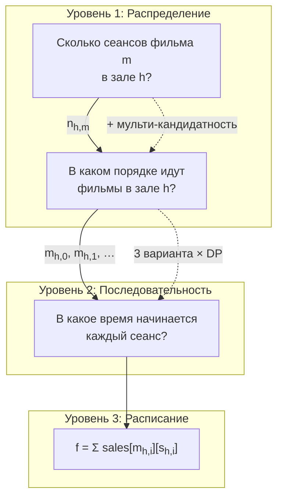
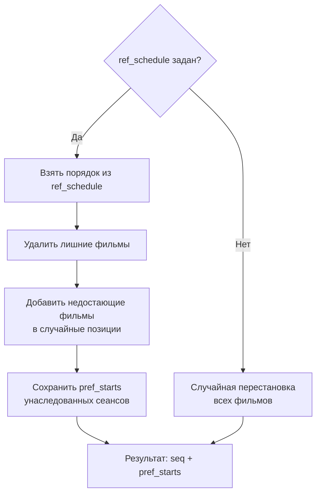
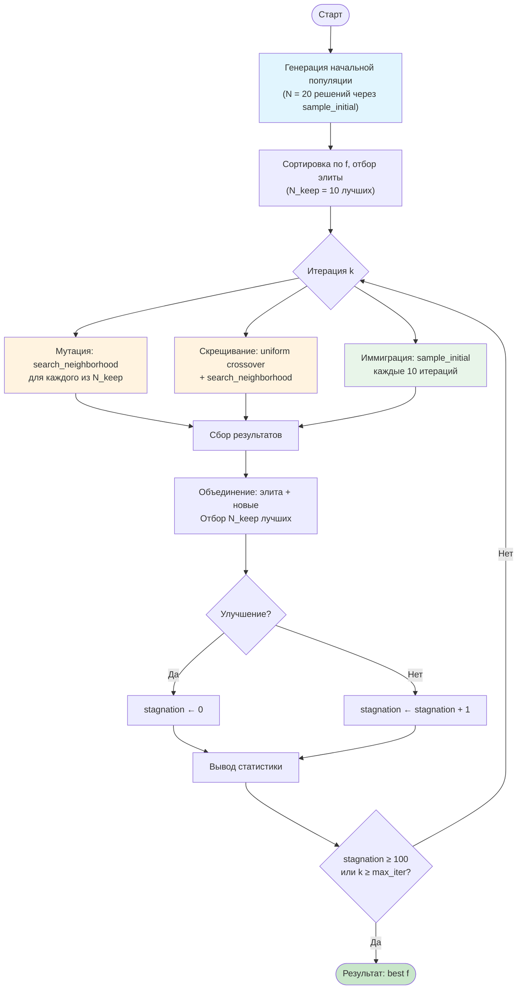
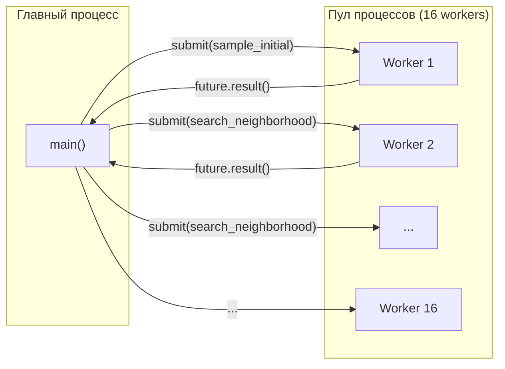
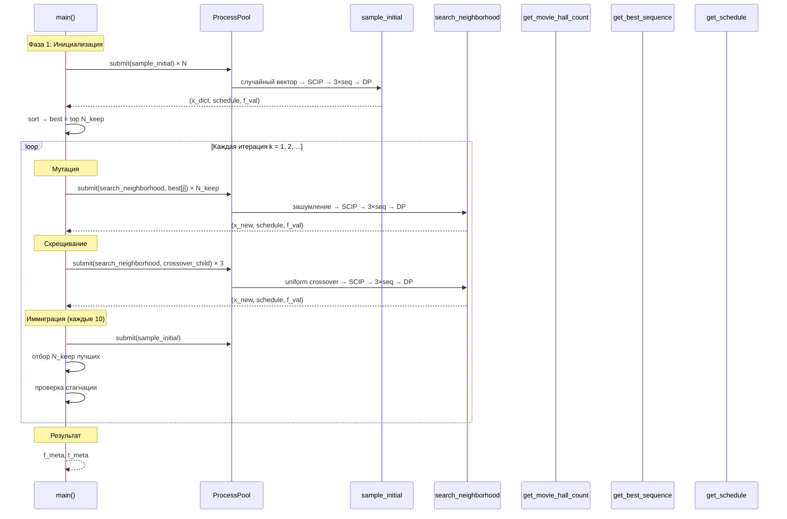

# Метаэвристика оптимизации расписания кинотеатра

> Файлы: `schedule-global.py`, `schedule_workers.py`, `schedule_data.py`
> Baseline: `schedule-cpsat.py`

---

## 1. Постановка задачи

### 1.1 Общая формулировка

Кинотеатр работает 24 часа (T = 288 пятиминутных шагов). Необходимо составить расписание сеансов, **максимизирующее суммарные ожидаемые продажи**, с учётом ограничений.

### 1.2 Входные данные

| Объект | Количество | Параметры |
|--------|-----------|-----------|
| Фильмы | 20 (10 формата A, 10 формата B) | Длительность `len` ∈ [12, 36] шагов (1–3 ч), лимит сеансов `[min, max]` |
| Залы | 10 (7 универсальных, 2 только A, 1 только B) | Макс. сеансов `max_shows` = 15 |
| Шаг времени | T = 288 | 5 минут (24 ч × 60 мин / 5 мин) |

**Матрица продаж** `sales[m][t] ∈ {1, …, 9}` — ожидаемые продажи одного сеанса фильма `m`, если он начинается в момент `t`. Это основная целевая функция.

### 1.3 Математическая модель

$$\max \sum_{h \in H} \sum_{i} \text{sales}\bigl[m_{h,i},\; s_{h,i}\bigr]$$

при ограничениях:

$$s_{h,i} + \text{len}(m_{h,i}) \leq T \quad \forall\, h, i$$

$$s_{h,i+1} \geq s_{h,i} + \text{len}(m_{h,i}) + 1 \quad \forall\, h, i$$

$$\text{format}(m) \in \text{supported\_formats}(h) \quad \forall\, \text{сеанс } (h, m)$$

$$\text{min}(m) \leq \sum_{h} n_{h,m} \leq \text{max}(m) \quad \forall\, m$$

где $s_{h,i}$ — время начала $i$-го сеанса в зале $h$, $m_{h,i}$ — фильм на этом сеансе, $n_{h,m}$ — число сеансов фильма $m$ в зале $h$.

### 1.4 Масштаб задачи

```
Переменные уровня расписания: 10 залов × ~18 фильмов × ~270 времён ≈ 48 600 булевых переменных
```

Прямой CP-SAT (монолитная модель) решает её за ~600 секунд, получая f ≈ 1237. Метаэвристика получает f ≈ 1202 за ~20 секунд (разрыв ≈ 2,8%).

---

## 2. Архитектура: трёхуровневая декомпозиция

Задача разбивается на три уровня принятия решений. Результаты верхнего уровня фиксируются и становятся ограничениями для нижнего.



| Уровень | Решает | Метод | Сложность |
|---------|--------|-------|-----------|
| **1** | Число сеансов `{(зал, фильм): кол-во}` | SCIP (целочисленное ЛП) | ~200 переменных, < 1 с |
| **2** | Порядок фильмов в зале | Эвристика + мульти-кандидатность | O(n) на зал |
| **3** | Точное время начала | Динамическое программирование | O(n · T) на зал |

---

## 3. Уровень 1: Распределение сеансов (SCIP)

### 3.1 Формулировка

Функция `get_movie_hall_count(movie_hall_count_rand)` решает задачу целочисленного линейного программирования через SCIP.

**Переменные:**

$$n_{h,m} \in \left[0,\; \bar{n}_{h,m}\right] \cap \mathbb{Z} \quad \forall\, h \in H,\; m \in M$$

$$c_m = \sum_{h} n_{h,m} \quad \text{(общее число сеансов фильма } m \text{)}$$

$$d_h = \sum_{m} n_{h,m} \quad \text{(общее число сеансов в зале } h \text{)}$$

**Ограничения:**

| # | Ограничение | Смысл |
|---|-------------|-------|
| 1 | $\text{min}(m) \leq c_m \leq \text{max}(m)$ | Лимиты показов фильма |
| 2 | $\sum_{m} (\text{len}(m) + 1) \cdot n_{h,m} \leq T + 1$ | Время в зале (сеанс + перерыв) |
| 3 | $n_{h,m} = 0$, если $\text{format}(m) \notin \text{formats}(h)$ | Совместимость форматов |

**Целевая функция** — минимизация L1-отклонения от предыдущего распределения:

$$\min \sum_{h,m} |n_{h,m} - n_{h,m}^{\text{ref}}|$$

Линеаризуется через вспомогательные переменные $\mu_{h,m} \geq |n_{h,m} - n_{h,m}^{\text{ref}}|$:

$$\mu_{h,m} \geq n_{h,m} - n_{h,m}^{\text{ref}}, \qquad \mu_{h,m} \geq n_{h,m}^{\text{ref}} - n_{h,m}$$

### 3.2 Роль в метаэвристике

SCIP выступает как **проектор**: зашумлённый вектор $\tilde{n}_{h,m}$ (возможно, недопустимый) преобразуется в ближайшее допустимое целочисленное распределение.

```python
# Из search_neighborhood:
p1 = dict_to_vec(x_ref)                                # текущее распределение → вектор
p1_noisy = np.random.normal(p1, (alpha ** k) * sigma)  # добавляем нормальный шум
p1_noisy = np.clip(np.round(p1_noisy), x_lb, x_ub)    # округляем и ограничиваем
x_new, _ = get_movie_hall_count(vec_to_full_dict(p1_noisy))  # SCIP → допустимое
```

### 3.3 Масштаб шума

Шум убывает с итерациями по экспоненте:

$$\sigma_{\text{eff}}(k) = \alpha^k \cdot \sigma, \qquad \alpha = 0{,}95$$

| Итерация $k$ | $\alpha^k$ | Уровень шума |
|:---:|:---:|:---|
| 1 | 0.95 | 95% от начального |
| 50 | 0.077 | 7.7% |
| 100 | 0.006 | Практически нулевой |
| 200 | 3.5 × 10⁻⁵ | Нулевой |

Это обеспечивает переход от глобального поиска (большие возмущения) к локальному (малые возмущения).

---

## 4. Уровень 2: Последовательность фильмов

### 4.1 Генерация последовательности

Функция `get_movie_hall_seq(movie_hall_count, ref_schedule)` формирует порядок фильмов в каждом зале.

**Два режима:**



**Инкрементальная модификация** (при наличии `ref_schedule`):

1. Берётся существующий порядок из ссылочного расписания.
2. Если фильм `m` стал показываться реже (`old_count > new_count`), случайные вхождения удаляются.
3. Если фильм стал показываться чаще (`new_count > old_count`), новые вхождения вставляются в случайные позиции.
4. Унаследованные времена начала сохраняются как `pref_starts` для Level 3.

### 4.2 Мульти-кандидатность

Функция `get_best_sequence()` генерирует несколько вариантов последовательности и выбирает лучший:

```python
for attempt in range(n_candidates):  # n_candidates = 3
    seq = get_movie_hall_count(..., ref_schedule if attempt == 0 else None)
    schedule = get_schedule(seq)      # DP максимизирует продажи
    score = get_goal(schedule)        # Оценка
    # Сохраняем лучший
```

- **Попытка 0**: использует `ref_schedule` как базу (эксплуатация)
- **Попытки 1, 2**: полностью случайные последовательности (исследование)
- Для каждой последовательности DP на уровне 3 находит оптимальные времена

---

## 5. Уровень 3: Оптимальное время начала (DP)

### 5.1 Задача для одного зала

Дано: в зале $h$ идёт $n$ сеансов в фиксированном порядке. Фильмы $m_0, m_1, \ldots, m_{n-1}$ с длительностями $l_0, l_1, \ldots, l_{n-1}$.

Найти: времена начала $t_0, t_1, \ldots, t_{n-1}$, максимизирующие:

$$\max \sum_{i=0}^{n-1} \text{sales}[m_i][t_i]$$

при ограничениях:

$$t_i + l_i \leq T \quad \forall\, i$$

$$t_{i+1} \geq t_i + l_i + 1 \quad \forall\, i < n-1$$

### 5.2 Алгоритм DP

**Обозначения:**

- $\text{dp}[i][t]$ — максимальные суммарные продажи для сеансов $i \ldots n{-}1$, если сеанс $i$ начинается в момент $t$.
- $\text{suf}[i][t] = \max_{t' \geq t} \text{dp}[i][t']$ — суффиксный максимум.

**Обратный проход** ($i = n{-}1 \to 0$):

$$\text{dp}[n{-}1][t] = \text{sales}[m_{n-1}][t], \quad t \in [0, \; T - l_{n-1}]$$

$$\text{dp}[i][t] = \text{sales}[m_i][t] + \text{suf}[i{+}1]\bigl[t + l_i + 1\bigr], \quad t \in [0, \; T - l_i]$$

```
Визуализация перехода:

  |---- сеанс i ----|gap|---- сеанс i+1 ---- ... ---- сеанс n-1 ----|
  t                 t+l+1
  ↳ sales[mᵢ][t]       ↳ suf[i+1][t+l+1] = лучший результат для хвоста
```

**Прямой проход** (восстановление решения):

$$t_0^* = \arg\max_{t \in [0,\, T-l_0]} \text{dp}[0][t]$$

$$t_i^* = \arg\max_{t \in [\text{earliest}_i,\, T-l_i]} \text{dp}[i][t]$$

где $\text{earliest}_i = t_{i-1}^* + l_{i-1} + 1$.

### 5.3 Сложность

| Компонент | Стоимость |
|-----------|-----------|
| Обратный проход | $O(n \cdot T)$ на зал |
| Суффиксный максимум | $O(T)$ на сеанс |
| Прямой проход | $O(n \cdot T)$ на зал |
| **Итого на зал** | $O(n \cdot T)$ |
| **Итого все залы** | $O(N_{\text{сеансов}} \cdot T) \approx 150 \times 288 \approx 43\,000$ операций |

Это **точное** решение для фиксированной последовательности (не приближённое). Выполняется за доли миллисекунды.

### 5.4 Реализация

```python
# База: последний сеанс
dp_last = [NEG_INF] * (T + 1)
for t in range(T - last_len + 1):
    dp_last[t] = int(sales[last_m][t])

# Обратный проход
for i in range(n - 2, -1, -1):
    dp_cur = [NEG_INF] * (T + 1)
    for t in range(T - length + 1):
        next_t = t + length + 1              # Следующий может начаться не раньше
        future = suf_arrays[i + 1][next_t]   # Лучший результат хвоста
        dp_cur[t] = int(sales[m][t]) + future
    # Суффиксный максимум
    suf = [NEG_INF] * (T + 2)
    for t in range(T, -1, -1):
        suf[t] = max(suf[t + 1], dp_cur[t])

# Прямой проход
earliest = 0
for i in range(n):
    best_t = argmax(dp[i][t] for t in [earliest, T - len_i])
    schedule[(h, i)] = {"movie": m, "start": best_t, "end": best_t + len_i}
    earliest = best_t + len_i + 1
```

---

## 6. Глобальный эволюционный алгоритм

### 6.1 Общая схема



### 6.2 Параметры алгоритма

| Параметр | Значение | Описание |
|----------|----------|----------|
| `N` | 20 | Размер популяции |
| `N_keep` | 10 | Размер элиты (50% от N) |
| `alpha` | 0.95 | Коэффициент затухания шума |
| `max_iter` | 1000 | Максимум итераций |
| `stagnation_limit` | 100 | Остановка при стагнации |
| `sigma_y` | 3.0 | Базовый масштаб шума |
| `SEED` | 42 | Seed для воспроизводимости |
| `n_candidates` | 3 | Число кандидатов в `get_best_sequence` |

### 6.3 Операторы

#### 6.3.1 Мутация (search_neighborhood)

Основной оператор генерации новых кандидатов. Для каждого из `N_keep` элитных решений:


Шум генерируется независимо для каждой активной пары (зал, фильм):

$$\tilde{n}_{h,m} = n_{h,m} + \varepsilon, \qquad \varepsilon \sim \mathcal{N}(0,\; \alpha^k \cdot \bar{n}_{h,m})$$

где $\bar{n}_{h,m}$ — верхняя граница числа сеансов для пары $(h, m)$.

#### 6.3.2 Скрещивание (uniform crossover)

Создаёт потомка от двух случайных родителей из элиты. Для каждой пары `(зал, фильм)` значение берётся от случайного родителя:

$$n_{h,m}^{\text{child}} = \begin{cases} n_{h,m}^{p_1} & \text{с вероятностью } 0{,}5 \\ n_{h,m}^{p_2} & \text{с вероятностью } 0{,}5 \end{cases}$$

Потомок подаётся в `search_neighborhood` с уменьшенным шумом (`sigma_y * 0.7`), чтобы не разрушать унаследованные свойства. Количество потомков: `N_keep // 3 ≈ 3`.

```python
# Uniform crossover
child_params = {}
for key in params1.keys():
    child_params[key] = params1[key] if random.random() < 0.5 else params2[key]
```

#### 6.3.3 Иммиграция

Каждые 10 итераций генерируется одно полностью случайное решение через `sample_initial()`. Предотвращает преждевременную сходимость и поддерживает генетическое разнообразие.

### 6.4 Отбор

На каждой итерации:

$$\text{best} = \text{Top}_{N\_keep}\bigl(\text{best}_{\text{prev}} \cup \text{new\_points}\bigr)$$

Элита предыдущей итерации участвует в отборе наравне с новыми кандидатами (элитизм).

### 6.5 Критерий остановки

Алгоритм останавливается при выполнении **любого** из условий:

1. **Стагнация**: `stagnation_count >= stagnation_limit` (100 итераций без улучшения `f`).
2. **Лимит итераций**: `k >= max_iter` (1000).

---

## 7. Параллелизация

Все вызовы `sample_initial` и `search_neighborhood` выполняются через `ProcessPoolExecutor`:



- Число воркеров: `min(os.cpu_count(), N)` = 16 на машине с 16 ядрами.
- Начальная выборка: батчами по `n_workers * 3` задач.
- Итерации: все `N_keep + n_crossover + immigration` задач запускаются одновременно.

---

## 8. Полный поток данных



---

## 9. Структура решения

Решение кодируется как кортеж из трёх элементов:

```python
solution = (
    x_dict,     # dict {(зал, фильм): кол-во} — распределение Level 1
    schedule,   # dict {(зал, индекс): {"movie": str, "start": int, "end": int}} — расписание
    f_val       # float — значение целевой функции
)
```

**Пример** (элемент `schedule`):

```python
{
    ("hall_1", 0): {"movie": "movie_3",  "start": 15, "end": 42},
    ("hall_1", 1): {"movie": "movie_12", "start": 43, "end": 67},
    ("hall_1", 2): {"movie": "movie_7",  "start": 68, "end": 89},
    ("hall_2", 0): {"movie": "movie_1",  "start": 0,  "end": 28},
    ...
}
```

---

## 10. Результаты

### 10.1 Сравнение методов

| Метод | f | Время | Отставание от CP-SAT |
|-------|---|-------|----------------------|
| Прямой CP-SAT (`schedule-cpsat.py`) | 1237 | 615 с | — |
| Метаэвристика (`schedule-global.py`) | 1171 | 26 с | 5,3% |
| Метаэвристика + CP-SAT warm start | 1257 | 636 с | **+1,6%** лучше |

### 10.2 Уточнение через CP-SAT с warm start

После завершения метаэвристики лучшее найденное расписание передаётся как начальное приближение (hint) в полную модель CP-SAT (`refine_with_cpsat`). Это позволяет комбинированному методу превзойти **оба** отдельных подхода.

**Механизм warm start:**

1. Расписание метаэвристики кодируется как множество активных сеансов `active_shows = {(зал, фильм, время_начала)}`.
2. Для каждой булевой переменной `x[h, m, t]` модели CP-SAT задаётся подсказка:
   - `model.add_hint(x[h, m, t], 1)` — если сеанс присутствует в расписании метаэвристики;
   - `model.add_hint(x[h, m, t], 0)` — в противном случае.
3. Аналогично подсказываются переменные уровня агрегации (`movie_count`, `hall_count`, `movie_hall_count`).

**Почему warm start превосходит чистый CP-SAT:**

- Чистый CP-SAT начинает поиск «с нуля» и за 600 секунд не всегда достигает оптимума (статус FEASIBLE, не OPTIMAL).
- Warm start предоставляет CP-SAT качественное начальное решение (f = 1171), от которого решатель может двигаться к лучшим значениям.
- Результат: **f = 1257** — на 20 единиц (1,6%) лучше, чем чистый CP-SAT (f = 1237) за сравнимое время (636 с vs 615 с).

**Типичный вывод:**

```
МЕТАЭВРИСТИКА: f = 1171, время = 26.0s
Всего вычислено точек: 2897

Уточнение через CP-SAT (warm start)...

CP-SAT:       f = 1257, статус = FEASIBLE, время = 610.0s
Метаэвристика: f = 1171, время = 26.0s
Улучшение:    +86 (7.3%)
Общее время:  636.0s
```

### 10.3 Типичный ход сходимости

```
Начальная выборка: 20 точек, лучшее f = 997

  Итерация   1: f = 1077 | новых = 13 | стагнация =  0
  Итерация  10: f = 1085 | новых = 14 | стагнация =  9
  Итерация  40: f = 1091 | новых = 14 | стагнация =  7
  Итерация  59: f = 1155 | новых = 13 | стагнация =  0   ← быстрый рост
  Итерация  76: f = 1162 | новых = 10 | стагнация =  0
  Итерация  82: f = 1186 | новых = 13 | стагнация =  0
  Итерация 126: f = 1202 | новых = 13 | стагнация =  0   ← лучший результат
  Итерация 226: f = 1202 | новых = 13 | стагнация = 100   ← останов

Итого: f = 1202, время = 20.2s, вычислено 2980 точек
```

### 10.4 Вклад каждого улучшения

| Улучшение | Вклад | Описание |
|-----------|-------|----------|
| DP с максимизацией продаж (Level 3) | **Основной** | Замена CP-SAT без целевой функции на точный DP с `sales` в целевой |
| Мульти-кандидатность (Level 2) | +2–5% | 3 варианта последовательности вместо 1 |
| Uniform crossover | ~0% | Не ухудшает, но и не даёт значимого прироста |
| Рестарт при стагнации | −1% | Разрушает хорошую популяцию; убран |

---

## 11. Варианты дальнейшего улучшения

### 11.1 Sales-aware Level 1 (SCIP)

Добавить линейный прокси продаж в целевую функцию SCIP:

$$\min \left[ \sum_{h,m} \mu_{h,m} - w \cdot \sum_{h,m} \overline{\text{sales}}(m) \cdot n_{h,m} \right]$$

где $w$ — настраиваемый вес, $\overline{\text{sales}}(m)$ — средние продажи фильма.

### 11.2 Продвинутые операторы скрещивания

- **Order crossover (OX)**: сохраняет порядок фильмов из родителей.
- **PMX (Partially Mapped Crossover)**: сохраняет относительный порядок.

### 11.3 Адаптивный шум

Вместо фиксированного $\alpha^k$ использовать адаптивный механизм:
- Увеличивать $\alpha$ при стагнации (расширять поиск).
- Уменьшать $\alpha$ при нахождении улучшения (сужать поиск).

### 11.4 Финальное уточнение через CP-SAT

Раскомментировать `refine_with_cpsat()` в `schedule-global.py` — запускает полную модель CP-SAT с warm start из лучшего решения метаэвристики.

---

## 12. Справка по файлам

```
optimisation/
├── schedule_data.py       # Входные данные (фильмы, залы, продажи, совместимость)
├── schedule_workers.py    # Трёхуровневый решатель + генерация решений
├── schedule-global.py     # Эволюционный алгоритм (main entry point)
├── schedule-cpsat.py      # Baseline: прямая модель CP-SAT
└── schedule-global.md     # Эта документация
```

### Краткая справка по функциям

| Функция | Файл | Назначение |
|---------|------|-----------|
| `sample_initial()` | workers | Случайное начальное решение (все 3 уровня) |
| `search_neighborhood()` | workers | Поиск в окрестности решения |
| `get_movie_hall_count()` | workers | Level 1: SCIP, распределение сеансов |
| `get_movie_hall_seq()` | workers | Level 2: порядок фильмов в зале |
| `get_best_sequence()` | workers | Мульти-кандидатная обёртка над Level 2+3 |
| `get_schedule()` | workers | Level 3: DP, оптимальные времена начала |
| `get_goal()` | workers | Вычисление целевой функции |
| `crossover_parents()` | global | Uniform crossover двух родителей |
| `refine_with_cpsat()` | global | Уточнение через полную модель CP-SAT |
| `main()` | global | Точка входа, эволюционный алгоритм |
